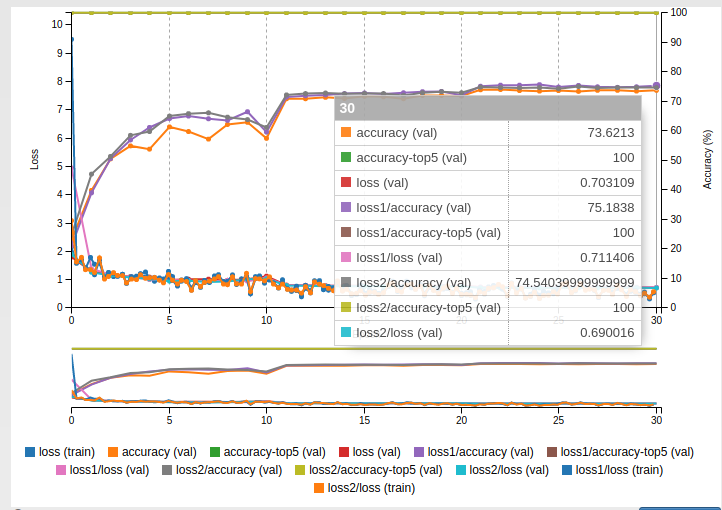
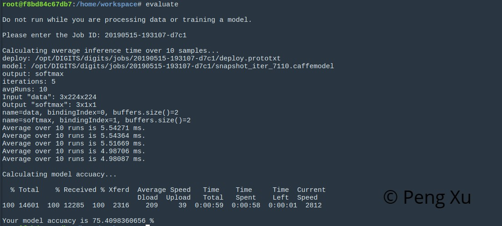

# RoboND Term2: Robotic Inference Project

This is the 1st project in Robotics Nanodegree Term 2.

The detailed explanation is presented in [writeup.pdf](./writeup.pdf).

## Introduction

The project aims to apply deep learning methods on robotic inference applications. Imagine there is a garden where several kinds of flowers are planted. The task for the robot is to recognize the flower species. Deep Learning is used to have an end-to-end learning and a state-of-art deep convolutional network model, GoogLeNet is used to train this model.

The training and evaluation process could be greatly simplified by Nvidia DIGITS platform. With only filling the hyperparameters, the data preprocessing and model building could be done using Cloud Computing.

Hopefully, the trained model could be directly applied on a Jetson TX1/TX2.

## Collected Data

https://www.dropbox.com/s/pbvdcnu2l0w5bgr/flowers-recognition.zip?dl=0

The dataset, Flowers, contains 4242 images of flowers. The data collection is based on the data flicr, google images, yandex images. The datastet to recognize 5 classes of flowers:: chamomile, tulip, rose, sunflower, dandelion. For each class there are about 800 Images. Images are not high resolution, about 320x240 pixels. Images are not reduced to a single size, they have different proportions.

## Results

## Discussion

The provided evaluate function could be used on the supplied dataset. After 30 epochs' training, the trained model could reach as high as 75.40\% test accuracy on an unseen test dataset. The inference time were a little higher than 5 ms which was within 10 ms which meets the requirement. Both results are shown in Fig. \ref{fig:supplied-evaluate}.

The test accuracy was much lower than the training accuracy which could happen for several reasons. Firstly, the dataset is small and the training is likely to overfit. The training accuracy is as high as around 100\% but it don't mean the similar performance when it comes to an unseen image. The issue could be addressed by data augmenting. Secondly, the model is over complicated for the data which also could lead to the overfit problem. One solution could be introducing more dropout layers. But in general, the performance is good enough for the robotic inference application.

